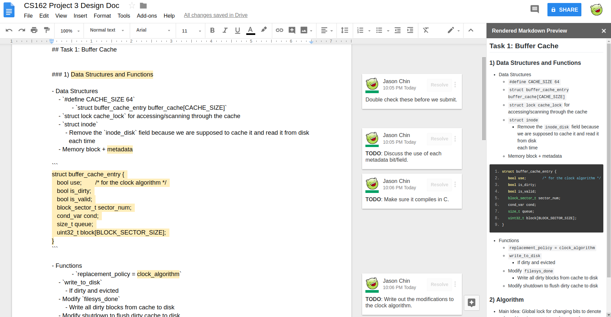
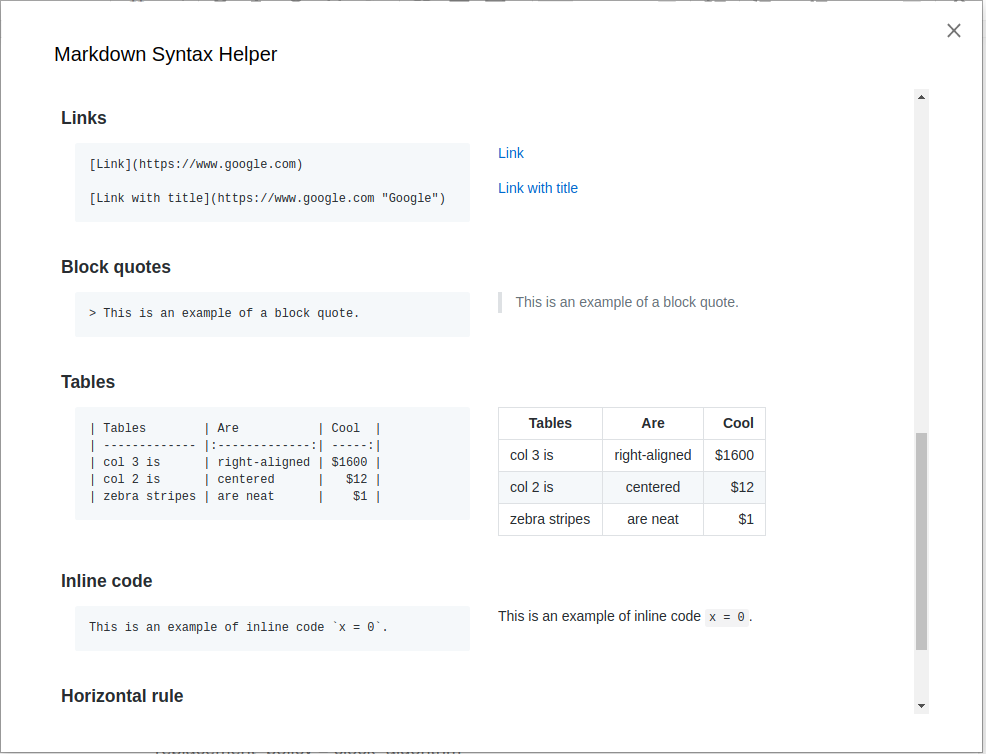

# Markdown Previewer for Google Docs

This tool is a markdown previewer add-on for Google Docs. It displays the preview of the rendered markdown in the sidebar of a Google Doc.

### Features

1) Live [github flavored markdown](https://github.com/adam-p/markdown-here/wiki/Markdown-Cheatsheet) while editing a Google Doc with others.
2) Clicking on the sidebar/rendered markdown will shift/scroll the Google Doc to the same location.
3) TODO: Clicking on the Google Doc will scroll the sidebar to the same location. (Make this optional.)

### Motivation

In my Operating Systems class (CS162), we worked in groups of 4 and had to write a design document in github markdown format of how we would approach the project of building a portion of the OS. As a group we needed to work collaboratively and so a shared Google Document came to mind as that is what most college students gravitate towards. Unfortunately Google Docs doesn't have a markdown preview so we were just writing in plain markdown.

There a few other options to markdown.

1) When I'm working by myself and I'm editting a README such as this, I work in Visual Studio and use a plugin for a live markdown preview.
2) For a web browser based approach, I use [stackedit](https://stackedit.io/app) which provides some Google Drive support but does not provide for live editing.
3) Some other student found [hackmd](https://hackmd.io/) which is a collaborative markdown editor but doesn't have many of the features that Google Docs has such as comments.

For that reason, I built this add-on so I could use the tools that Google Docs provide (namely comments and being collaborative) while being able to view the markdown preview while I type.

### Screenshots

- A typical workflow.

- A helper window to display Github flavored markdown syntax.

### Resources

- https://github.com/showdownjs/showdown
    - To parse and translate the markdown to html to be displayed

- https://github.com/unional/showdown-highlightjs-extension
    - To add highlighting hints for Google's code-prettify

- https://github.com/google/code-prettify
    - To highlight the code using the highlighting hints (using the desert theme)

- https://github.com/sindresorhus/github-markdown-css
    - To mirror Github's markdown css

- https://github.com/google/clasp
    - For local development of Google App Script add-ons
